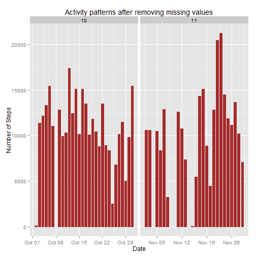
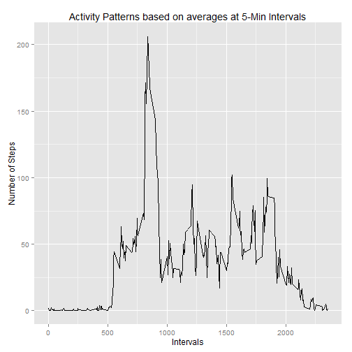
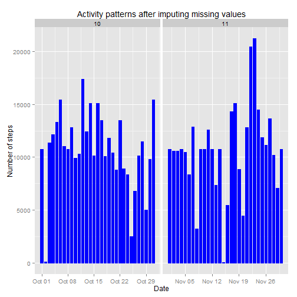
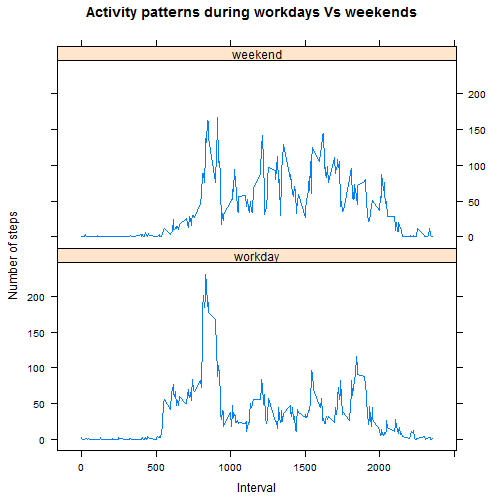

## Reproducible Research: Peer Assessment 1

### Housekeeping activities


```r
    echo = TRUE  # Make code visible for peer review

    library(ggplot2)
    library(lattice)
```

### Task-1: Loading and preprocessing the data


```r
    ### Unzip and read the input .csv file
    unzip("activity.zip")
    df <- read.csv("activity.csv", colClasses = c("integer", "Date", "factor"))
    
    ### Add a new column 'month'
    df$month <- as.numeric(format(df$date, "%m"))

    ### Display original number of rows
    rownames(df) <- 1:nrow(df)
    dim(df)
```

```
## [1] 17568     4
```

```r
    head(df)
```

```
##   steps       date interval month
## 1    NA 2012-10-01        0    10
## 2    NA 2012-10-01        5    10
## 3    NA 2012-10-01       10    10
## 4    NA 2012-10-01       15    10
## 5    NA 2012-10-01       20    10
## 6    NA 2012-10-01       25    10
```

```r
    ### Remove all NAs from df
    df1 <- na.omit(df)

    ### Display new number of rows
    rownames(df1) <- 1:nrow(df1)
    dim(df1)
```

```
## [1] 15264     4
```

```r
    head(df1)
```

```
##   steps       date interval month
## 1     0 2012-10-02        0    10
## 2     0 2012-10-02        5    10
## 3     0 2012-10-02       10    10
## 4     0 2012-10-02       15    10
## 5     0 2012-10-02       20    10
## 6     0 2012-10-02       25    10
```

### Task-2: What is mean total number of steps taken per day?

For this part of the assignment, you can ignore the missing values in the dataset.

Determine the activity patterns based on the 'Daily Total Number of Steps Taken' with missing values removed from input data

* Make a histogram of the total number of steps taken each day


```r
    ### Plot graph with daily total number of steps taken
    ggplot(df1, aes(date, steps)) + 
        geom_bar(stat="identity", colour="brown", fill="brown", width=0.7) + facet_grid(. ~ month, scales="free") + 
        labs(title="Activity patterns after removing missing values", x="Date", y="Number of Steps")
```

 

* Calculate and report the mean and median total number of steps taken per day

    Daily Total, Mean and Median number of steps taken:


```r
    ### Display daily total, mean and median number of steps taken
    dailySteps  <- aggregate(df1$steps, list(Date = df1$date), FUN = "sum")$x
    dailySteps
```

```
##  [1]   126 11352 12116 13294 15420 11015 12811  9900 10304 17382 12426
## [12] 15098 10139 15084 13452 10056 11829 10395  8821 13460  8918  8355
## [23]  2492  6778 10119 11458  5018  9819 15414 10600 10571 10439  8334
## [34] 12883  3219 12608 10765  7336    41  5441 14339 15110  8841  4472
## [45] 12787 20427 21194 14478 11834 11162 13646 10183  7047
```

```r
    dailyMean   <- mean(dailySteps)
    dailyMean
```

```
## [1] 10766.19
```

```r
    dailyMedian <- median(dailySteps)
    dailyMedian
```

```
## [1] 10765
```

### Task-3: What is the average daily activity pattern?

Determine the activity patterns based on the 'Average Number of Steps Taken at 5-Min Intervals' with missing values removed from input data.

* Make a time series plot (i.e. type = "l") of the 5-minute interval (x-axis) and the average number of steps taken, averaged across all days (y-axis)


```r
    ### Plot time-series interval graph with average number of steps taken at 5-min intervals
    intervalSteps <- aggregate(df1$steps, list(interval = as.numeric(as.character(df1$interval))), FUN = "mean")
    names(intervalSteps)[2] <- "meanSteps"

    ggplot(intervalSteps, aes(interval, meanSteps)) + geom_line(color="black", size=0.7) + 
        labs(title="Activity Patterns based on averages at 5-Min Intervals", x="Intervals", y="Number of Steps")
```

 

* Which 5-minute interval, on average across all the days in the dataset, contains the maximum number of steps?


```r
    ### Display the interval that has the maximum number of steps
    intervalSteps[intervalSteps$meanSteps == max(intervalSteps$meanSteps), ]
```

```
##     interval meanSteps
## 104      835  206.1698
```

### Task-4: Imputing missing values

Determine the activity patterns based on 'Daily Total Number of Steps Taken' with missing values substituted with interval means in input data.

* The total number of rows with NAs:


```r
    ### Display number of rows with NAs
    sum(is.na(df))
```

```
## [1] 2304
```

```r
    head(df)
```

```
##   steps       date interval month
## 1    NA 2012-10-01        0    10
## 2    NA 2012-10-01        5    10
## 3    NA 2012-10-01       10    10
## 4    NA 2012-10-01       15    10
## 5    NA 2012-10-01       20    10
## 6    NA 2012-10-01       25    10
```

* Devise a strategy for filling in all of the missing values in the dataset. The strategy does not need to be sophisticated. For example, you could use the mean/median for that day, or the mean for that 5-minute interval, etc.

    Strategy: Use the interval means as filler values.

* Create a new dataset that is equal to the original dataset but with the missing values filled in with interval means.


```r
    df2 <- df
    for (i in 1:nrow(df2)) {
        if (is.na(df2$steps[i])) {
            df2$steps[i] <- intervalSteps[which(df2$interval[i] == intervalSteps$interval), ]$meanSteps
        }
    }

    ### Display new number of rows with NAs
    sum(is.na(df2))
```

```
## [1] 0
```

```r
    head(df2)
```

```
##       steps       date interval month
## 1 1.7169811 2012-10-01        0    10
## 2 0.3396226 2012-10-01        5    10
## 3 0.1320755 2012-10-01       10    10
## 4 0.1509434 2012-10-01       15    10
## 5 0.0754717 2012-10-01       20    10
## 6 2.0943396 2012-10-01       25    10
```

* Make a new histogram of the daily total number of steps taken with filled in missing data and Calculate the new mean and new median number of steps taken per
day.


```r
    ### Plot graph showing the new daily total number of steps taken with missing values filled in 
    ggplot(df2, aes(date, steps)) + 
        geom_bar(stat="identity", colour="blue", fill="blue", width=0.7) + facet_grid(. ~ month, scales="free") + 
        labs(title="Activity patterns after imputing missing values", x="Date", y="Number of steps")
```

 

New Daily Total, Mean and Median number of steps taken:


```r
    ### Display new daily total, mean and median values
    newDailySteps  <- aggregate(df2$steps, list(Date = df2$date), FUN = "sum")$x
    newDailySteps
```

```
##  [1] 10766.19   126.00 11352.00 12116.00 13294.00 15420.00 11015.00
##  [8] 10766.19 12811.00  9900.00 10304.00 17382.00 12426.00 15098.00
## [15] 10139.00 15084.00 13452.00 10056.00 11829.00 10395.00  8821.00
## [22] 13460.00  8918.00  8355.00  2492.00  6778.00 10119.00 11458.00
## [29]  5018.00  9819.00 15414.00 10766.19 10600.00 10571.00 10766.19
## [36] 10439.00  8334.00 12883.00  3219.00 10766.19 10766.19 12608.00
## [43] 10765.00  7336.00 10766.19    41.00  5441.00 14339.00 15110.00
## [50]  8841.00  4472.00 12787.00 20427.00 21194.00 14478.00 11834.00
## [57] 11162.00 13646.00 10183.00  7047.00 10766.19
```

```r
    newDailyMean   <- mean(newDailySteps)
    newDailyMean
```

```
## [1] 10766.19
```

```r
    newDailyMedian <- median(newDailySteps)
    newDailyMedian
```

```
## [1] 10766.19
```

* Do these values differ from the estimates from the first part of the assignment? What is the impact of filling missing values on the estimates of the total daily number of steps?

    In order to determine this calculate and compare the difference between the original and new Mean and Median values.


```r
    ### display difference between the original and new mean and median values
    diffMean <- newDailyMean - dailyMean
    diffMean
```

```
## [1] 0
```

```r
    diffMedian <- newDailyMedian - dailyMedian
    diffMedian
```

```
## [1] 1.188679
```

Observation: There is no difference between the two means, which indicates that replacing missing values with interval means has no impact on the overall mean value.

However, the new median is larger than the original median which is due to the difference in the number of observations in the input data.

### Task-5: Are there differences in activity patterns between workdays and weekends?

* Create a new factor variable in the dataset with two levels -- "workday" and "weekend" indicating whether a given date is a workday or weekend day.


```r
    ### Display average number of steps taken during workdays and weekends
    head(df2)
```

```
##       steps       date interval month
## 1 1.7169811 2012-10-01        0    10
## 2 0.3396226 2012-10-01        5    10
## 3 0.1320755 2012-10-01       10    10
## 4 0.1509434 2012-10-01       15    10
## 5 0.0754717 2012-10-01       20    10
## 6 2.0943396 2012-10-01       25    10
```

```r
    df2$weekdays <- factor(format(df2$date, "%A"))
    levels(df2$weekdays)
```

```
## [1] "Friday"    "Monday"    "Saturday"  "Sunday"    "Thursday"  "Tuesday"  
## [7] "Wednesday"
```

```r
    levels(df2$weekdays) <- list(workday=c("Monday", "Tuesday", "Wednesday", "Thursday", "Friday"), 
                                 weekend=c("Saturday", "Sunday"))
    levels(df2$weekdays)
```

```
## [1] "workday" "weekend"
```

```r
    table(df2$weekdays)
```

```
## 
## workday weekend 
##   12960    4608
```

* Make a panel plot containing a time series plot (i.e. type = "l") of the 5-minute interval (x-axis) and the average number of steps taken, averaged across all weekday days or weekend days (y-axis).


```r
    ### Plot graph showing the total number of steps taken during the workdays and weekends
    weekdaysSteps <- aggregate(df2$steps, 
                          list(interval = as.numeric(as.character(df2$interval)), weekdays = df2$weekdays), FUN = "mean")
    names(weekdaysSteps)[3] <- "meanSteps"

    xyplot(weekdaysSteps$meanSteps ~ weekdaysSteps$interval | weekdaysSteps$weekdays, layout=c(1, 2), type="l",
           main="Activity patterns during workdays Vs weekends", xlab="Interval", ylab="Number of steps")
```

 

